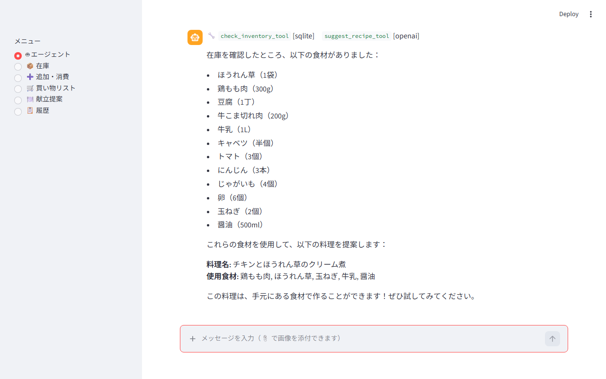
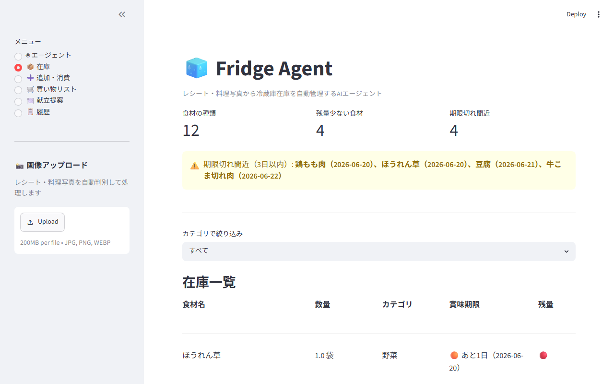
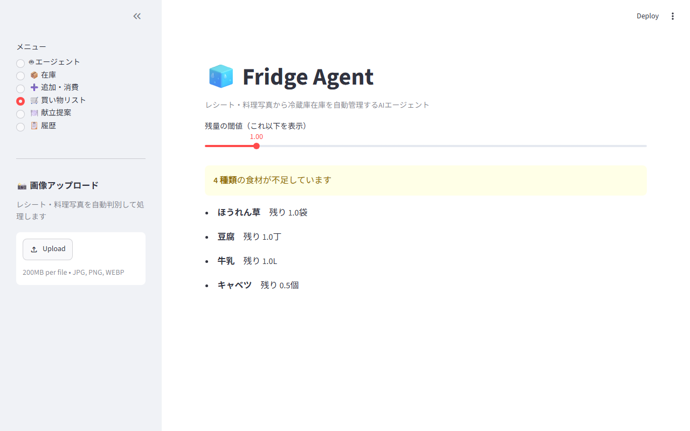
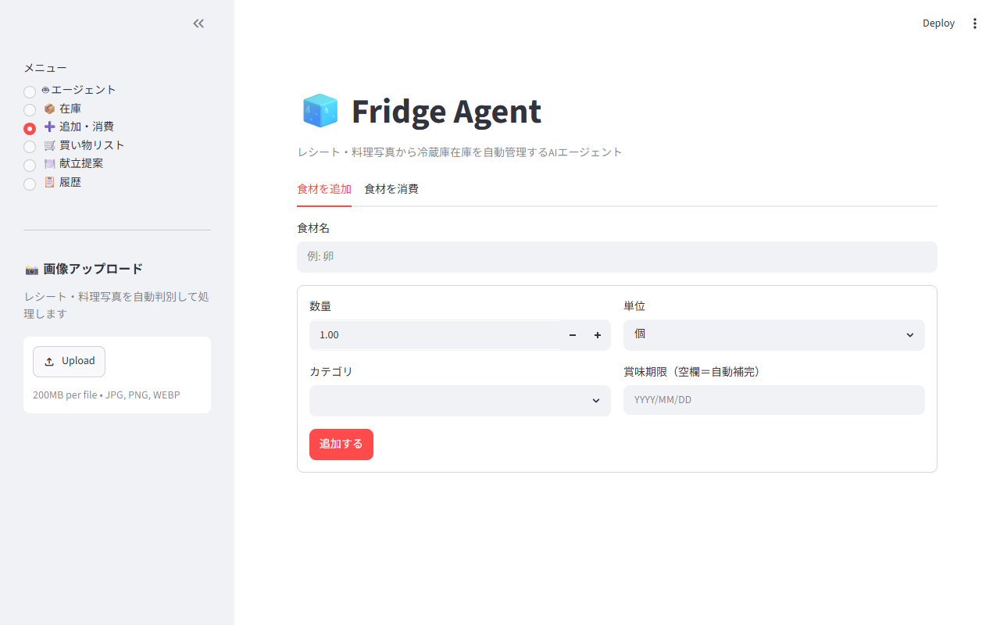
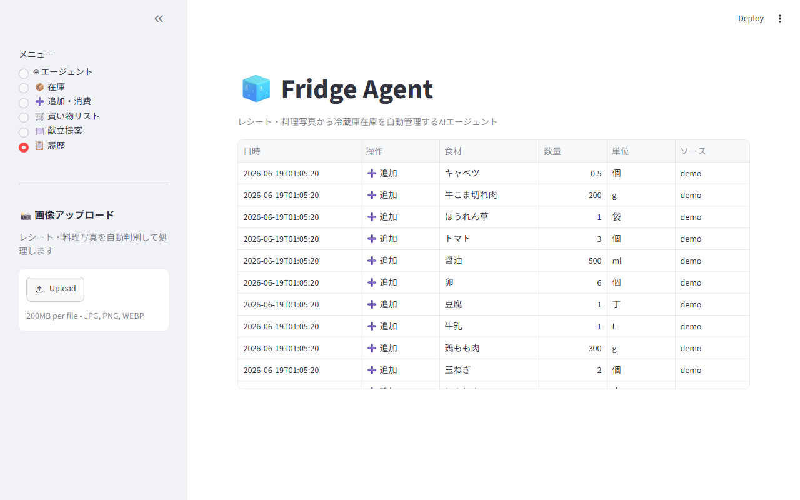
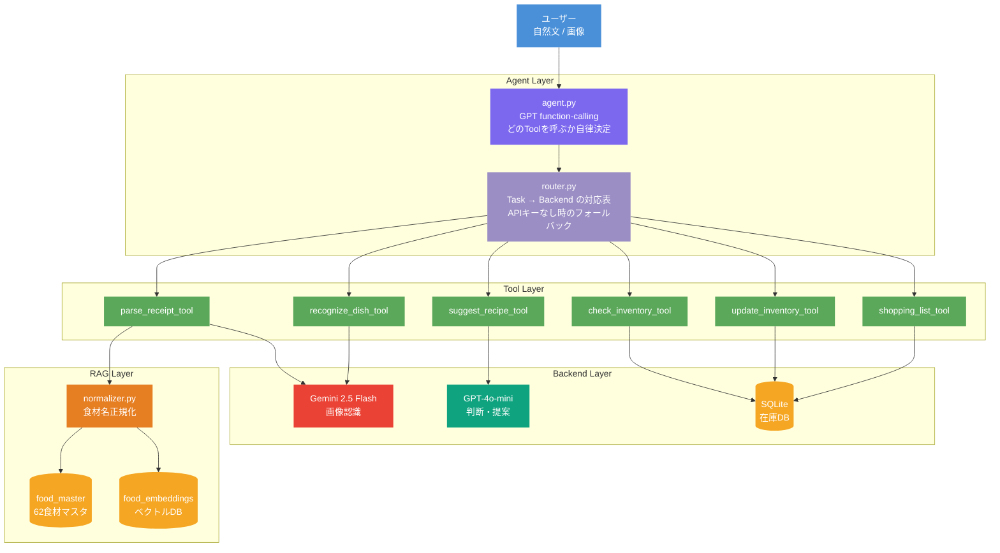

# Fridge Agent — 冷蔵庫在庫管理 AI エージェント

レシートと料理写真から冷蔵庫の在庫を自動管理する AI エージェント。
ユーザーが目標を自然文で伝えるだけで、エージェントが複数の Tool を自律的に呼び出して処理します。

> 本プロジェクトは AIエージェントのアーキテクチャ（OpenAI と Google のハイブリッド構成 + 領域別ルーティング層）を個人スケールで再現することを設計目標としています。

---

## デモ

### AI エージェントが在庫確認 → 献立提案を自律実行



> GPT が「どの Tool を呼ぶか」を自律決定。`check_inventory_tool [sqlite]` → `suggest_recipe_tool [openai]` の順に呼び出し、在庫食材から献立を提案。

---

### 在庫一覧（賞味期限アラート付き）



---

### 買い物リスト / 追加フォーム / 操作履歴

| 買い物リスト | 食材を追加 | 操作履歴 |
|---|---|---|
|  |  |  |

---

## 主な機能

| 機能 | 説明 | バックエンド |
|---|---|---|
| **レシート読み取り** | レシート画像 → 食材リスト → 在庫自動追加 | Gemini 2.5 Flash |
| **料理写真から消費** | 料理写真 → 使用食材を推定 → 在庫から消費 | Gemini 2.5 Flash |
| **自然文エージェント** | "在庫確認して献立提案して" → Tool を自律呼び出し | GPT-4o-mini + function-calling |
| **賞味期限管理** | 食材ごとの標準賞味期限を自動補完・アラート表示 | SQLite |
| **食材名 RAG 正規化** | "淡路たまねぎ" → "玉ねぎ" にベクトル検索で正規化 | OpenAI embedding + SQLite |
| **買い物リスト** | 在庫が閾値以下の食材を自動抽出 | SQLite |

---

## アーキテクチャ



### 設計のポイント

| レイヤー | 役割 | 設計の意図 |
|---|---|---|
| **Agent** | GPT が function-calling で Tool を自律選択 | LLM が "脳"、Tool が "手足" |
| **Router** | Task → Backend の単一対応表 | モデル差し替え時の変更箇所を1ファイルに集約 |
| **RAG Normalizer** | ベクトル検索で食材名を正規化 | ファジーマッチ（API不要）→ 埋め込み検索の2段構え |

---

## RAG 正規化の仕組み

```
[Index（オフライン）]   build_master.py --embed
  食材マスタ 62件 → text-embedding-3-small → SQLite (food_embeddings)

[Retrieve（実行時）]   normalize("淡路たまねぎ")
  Step1: ファジーマッチ (difflib)  → スコア >= 0.72 で採用（API不要・高速）
  Step2: 埋め込みベクトル検索     → cos類似度 >= 0.80 で採用（意味的類似）

[Augment]             parse_receipt() の Gemini プロンプトに正規名リストを注入
  → Gemini が出力段階で正規名に揃えやすくなる
```

---

## セットアップ

### 1. 依存をインストール

```bash
pip install -r requirements.txt
```

### 2. API キーを設定

```bash
cp .env.example .env
# .env を編集して GEMINI_API_KEY と OPENAI_API_KEY を記入
```

> `OPENAI_API_KEY` が未設定でも、エージェントはキーワードベースの**ルールベースモード**で動作します。

### 3.（任意）食材マスタと埋め込みを構築

```bash
python build_master.py          # マスタDB更新
python build_master.py --embed  # 埋め込み生成（OPENAI_API_KEY 必要）
```

### 4. アプリを起動

```bash
streamlit run app.py
```

---

## テスト

API 呼び出しはすべてモック済み。API キー不要で実行できます。

```bash
python -m pytest -q   # 88 件
```

| テストファイル | 対象 |
|---|---|
| `tests/test_db.py` | 在庫の追加・消費・賞味期限ロジック |
| `tests/test_tools.py` | 各 Tool（Vision はモック） |
| `tests/test_vision.py` | JSON パーサ / router 判定 |
| `tests/test_agent.py` | エージェントの自律 Tool 呼び出し / フォールバック |
| `tests/test_expiry.py` | 標準賞味期限マスタ |
| `tests/test_normalizer.py` | RAG 正規化（ファジーマッチ・alias 解決） |

---

## ディレクトリ構成

```
Agent/
├── app.py                  # Streamlit UI（チャット形式）
├── demo.py                 # 対話型 CLI デモ
├── build_master.py         # 食材マスタ & 埋め込み構築スクリプト
├── check_api.py            # API 疎通確認
├── src/
│   ├── agent.py            # GPT 主導の自律 Tool 呼び出し
│   ├── router.py           # Task → Backend ルーティング層
│   ├── vision.py           # Gemini Vision（レシート / 料理写真）
│   ├── tools.py            # 6 つの Tool 定義
│   ├── db.py               # SQLite 在庫ストア
│   ├── normalizer.py       # RAG 食材名ノーマライザー
│   ├── food_master_data.py # 食材マスタデータ（62 食材）
│   └── expiry_master.py    # 標準賞味期限マスタ
└── tests/                  # 88 件（API モック済み）
```

---

## 技術スタック

| 分類 | 技術 |
|---|---|
| Language | Python 3.11 |
| 画像認識 | Google Gemini API（Gemini 2.5 Flash） |
| 判断・対話 | OpenAI API（gpt-4o-mini / function-calling） |
| 食材名正規化 | OpenAI Embeddings（text-embedding-3-small）+ difflib |
| DB | SQLite |
| UI | Streamlit |
| Test | pytest（88 件） |

---

## 設計判断

技術的な判断の記録は [DECISIONS.md](DECISIONS.md) を参照してください。
マルチベンダー構成の理由・フォールバック設計・RAGパターンの適用について記録しています。
